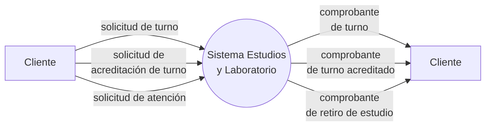

# OffCanvas
OffCanvas

```mermaid
flowchart LR
Cliente-->|solicitud de turno|Sistema((Sistema Estudios \n y Laboratorio))
Sistema -->|comprobante \nde turno| Cliente2[Cliente]
Cliente-->|solicitud de \n acreditación de turno|Sistema((Sistema Estudios \n y Laboratorio))
Sistema -->|comprobante \n de turno acreditado| Cliente2[Cliente]
Cliente-->|solicitud de atención|Sistema((Sistema Estudios \n y Laboratorio))
Sistema -->|comprobante \nde retiro de estudio| Cliente2[Cliente]
```
